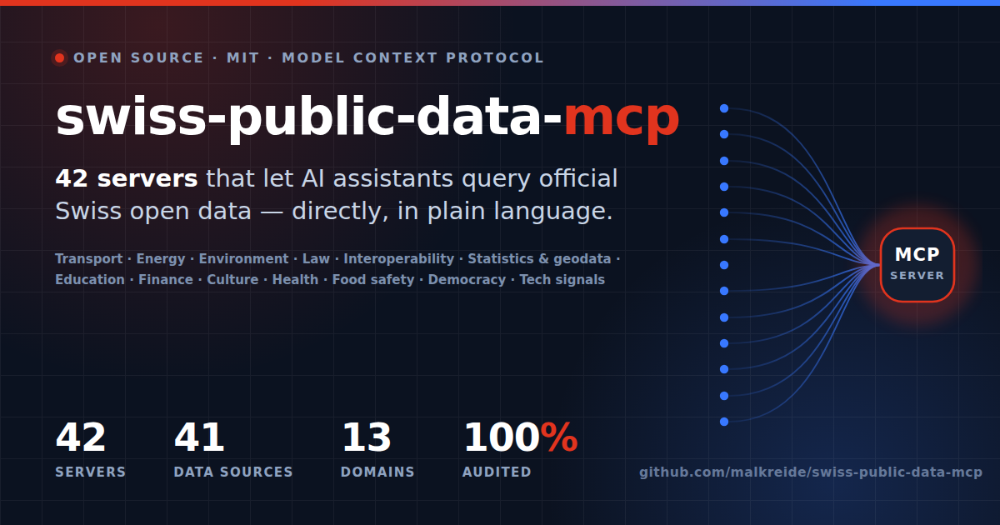

# swiss-public-data-mcp

<p align="center">
  
</p>


> A curated portfolio of Model Context Protocol (MCP) servers connecting AI agents to Swiss public and open data. The portfolio is maintained as an auditable inventory, not a loose list of experiments.

[🇩🇪 Deutsche Version](README.de.md)

> ⚠️ **Disclaimer - independence of this project**
>
> This is a **personal open-source project** by Hayal Oezkan. It is developed in private capacity, on private time, with private infrastructure. It is **not** an official project of the City of Zurich, the Schulamt, the KI-Fachgruppe der Stadtverwaltung Zurich, or any other public institution. References to municipal or federal strategies are descriptive context only. They do not imply endorsement, mandate, affiliation, or production use by any institution.

---

## Current Snapshot

Last checked: **2026-07-28**

| Metric | Current value |
|---|---:|
| Active portfolio servers | 42 |
| Production-ready active servers | 42 |
| MCP server repos with at least one audit | 44 |
| Legacy / archived MCP server repos | 2 |
| Audit tooling repos | 2 |
| `opendata.swiss` datasets | 14'551 via `package_search?rows=0` |
| Machine-readable source of truth | [`portfolio.json`](portfolio.json) |
| MCP Registry entries (generated) | [`registry/`](registry/) |
| Publishing runbook | [`RUNBOOK.md`](RUNBOOK.md) |
| Promotion & distribution | [`PROMOTION.md`](PROMOTION.md) |
| Client install snippets | [`docs/INSTALL.md`](docs/INSTALL.md) |
| `opendata.swiss` showcase submission | [`docs/SHOWCASE.md`](docs/SHOWCASE.md) |
| Required discovery topic | [`swiss-public-data-mcp`](https://github.com/topics/swiss-public-data-mcp) |
| Current MCP spec baseline for new audits | [`2025-11-25`](https://modelcontextprotocol.io/specification/versioning) |

All developed MCP server repositories in this inventory have completed at least one audit, and every active server is production ready. Two repositories are **archived on GitHub** (read-only) and are listed separately under [Legacy / Superseded](#-legacy--superseded) so that nothing in the active tables points at a repository that no longer accepts changes.

The portfolio intentionally distinguishes **core Swiss public-data servers** from **adjacent context servers**. Adjacent servers, such as global education or technology-signal monitoring, are useful in combined workflows but are not presented as Swiss government data sources.

Every server row links to the **official data portal or API it reads from**. No server hosts, mirrors, or re-publishes data: each one is a thin, read-only client for a public endpoint, and the publishing organisation remains the authoritative source.

---

## Why This Exists

**The problem.** `opendata.swiss` lists roughly 14'500 public datasets, and the broader Swiss data landscape adds GeoAdmin, Fedlex, the SNB data portal, BAFU, BFS PxWeb, swisstopo, parliamentary OData, cantonal law collections, city open-data portals, and sector-specific APIs. Every one of them speaks a different dialect — CKAN, PxWeb, SPARQL, OData, OGC, OpenDataSoft, bespoke REST. Publishing the data was the first mile. Making it *usable without a developer in the loop* is the last mile, and it is still missing.

**The gap this closes.** An AI assistant cannot browse a portal, read a schema, and guess a query. It needs a small, typed, documented interface per source. This portfolio provides exactly that: each server turns one public-data source, or one coherent source family, into MCP tools that clients such as Claude Desktop, VS Code + Continue, Cursor, Windsurf, or custom agents can call directly. Nothing is copied or re-hosted — every server is a thin, read-only client, and the publishing organisation stays the authoritative source.

**Who it is for.** Public administrations evaluating what open data can do inside an AI assistant; journalists and researchers who need to cross-reference official sources; civic-tech developers who would otherwise write the same API client for the fifth time; and anyone who wants to ask a question in plain language instead of assembling four API calls by hand.

**What that looks like in practice.** Ask *"Which school buildings in the City of Zurich lack fibre, how many pupils does each Schulkreis carry, and what does cantonal law require?"* — one question that touches [Open Data Zurich](https://data.stadt-zuerich.ch/), cantonal education statistics, and the Zurich law collection. Without MCP that is three integrations and an afternoon. With it, three servers answer in one conversation, each citing its official source.

**Why a portfolio rather than one server.** The value compounds when sources combine: transport plus road mobility enables multimodal routing; statistics plus geodata enables spatial analysis; education plus law plus parliamentary data supports policy research. A single monolithic server could not be audited, versioned, or adopted piecemeal — 42 small ones can.

---

## Zurich Focus

The City and Canton of Zurich are the portfolio's deepest coverage, and the reason it started: the original question was what municipal open data can actually do inside an AI assistant. Three servers read directly from the official Zurich portals.

<!-- BEGIN GENERATED: zurich-spotlight -->
| Server | Official data portal | What it covers |
|---|---|---|
| [zurich-opendata-mcp](https://github.com/malkreide/zurich-opendata-mcp) | [Open Data Zurich](https://data.stadt-zuerich.ch/) | City of Zurich weather, air quality, parking, geodata, Gemeinderat, tourism |
| [zh-education-mcp](https://github.com/malkreide/zh-education-mcp) | [Canton Zurich education statistics](https://www.zh.ch/de/bildung.html) | Canton and City of Zurich education data: schools, statistics, infrastructure |
| [openlex-mcp](https://github.com/malkreide/openlex-mcp) | [Zurich cantonal law (ZH-Lex)](https://www.zh.ch/de/politik-staat/gesetze-beschluesse.html) | Canton Zurich legislation via ZH-Lex with full-text search and article extraction |
<!-- END GENERATED: zurich-spotlight -->

Beyond these, [Open Data Zurich](https://data.stadt-zuerich.ch/) datasets also surface through `swiss-statistics-mcp`, `swiss-housing-mcp`, and `swiss-electricity-mcp` (ewz tariffs). See the [School-infrastructure audit](#combination-scenarios) scenario for a worked example combining all of them.

---

## Public-Sector Strategy Context

The portfolio was built bottom-up from integration needs, not top-down from a strategy document. Still, its design maps cleanly to public-sector digital agendas:

| Strategy | Portfolio contribution |
|---|---|
| [Strategien Zurich 2040](https://www.stadt-zuerich.ch/de/politik-und-verwaltung/politik-und-recht/strategie-politikfelder/zuerich-2040.html) | Turns "published open data" into "agent-usable open data" through reusable MCP interfaces. |
| [Digitalisierungsstrategie Stadt Zurich 2024](https://www.stadt-zuerich.ch/content/dam/web/de/politik-verwaltung/stadtverwaltung/fd/digitalisierungsstrategie.pdf) | Supports user-focused digital services, information sharing, and responsible data use without rebuilding existing APIs. |
| [SB021 - Strategy for AI systems in the Federal Administration](https://www.bk.admin.ch/bk/de/home/digitale-transformation-ikt-lenkung/vorgaben/sb021-strategie-einsatz-von-ki-systemen-in-der-bundesverwaltung.html) | Provides a public, readable competence-building artefact with explicit audit and risk methodology. |
| [Digital Switzerland Strategy 2026](https://www.admin.ch/en/newnsb/d6evGIoTYTmY4VMGk0-v0) | Extends the practical value of public digital infrastructure by making data sources LLM-consumable through a common protocol. |

These links are context, not authority. The repository remains a private open-source project.

---

## Quality & Audit Tooling

The audit methodology is now linked to the public [`mcp-audit-skill`](https://github.com/malkreide/mcp-audit-skill) repository instead of being described as an internal-only catalogue. It is complemented by [`mcp-continuous-auditor`](https://github.com/malkreide/mcp-continuous-auditor), which runs continuous CI audits against MCP servers using promptfoo as a deterministic source of truth. The skill currently documents **112 checks across twelve categories**, on a dual spec baseline (`2025-11-25` and `2026-07-28`):

| Category | Coverage |
|---|---|
| `ARCH` | Tool design, annotations, idempotency, repo structure, spec-version alignment |
| `SDK` | FastMCP / TypeScript / Zod / lifecycle |
| `SEC` | OAuth proxy risks, confused-deputy risks, SSRF, session hijacking, prompt-injection surface, secret handling |
| `SCALE` | Transport, statelessness, containerisation, load balancing, gateway compatibility |
| `OBS` | Logging, errors, SIEM, tracing, trace correlation |
| `HITL` | Sampling and human-in-the-loop behaviour |
| `CH` | Swiss DSG / EDOB / public-sector compliance considerations |
| `OPS` | Test strategy, documentation, phase architecture, release hygiene |
| `FID` | Data fidelity: scope defaults, recall against ground truth, empty results, query syntax |
| `IDENT` | Identity: user agent, `__version__`, manifest and documented version, release gap, artefact health |
| `DRIFT` | Upstream contract and repo prose: endpoint drift, fallback semantics, test quality, CHANGELOG vs code |
| `DEP` | Resolution space of the published artefact: upper bounds, major upgrades |

The audit skill is **not** a vulnerability scanner and **not** a compliance certificate. It is a reproducible review method. Architecture judgement remains human.

### Audit Gate

The portfolio now separates server maturity from audit evidence:

| Field | Meaning |
|---|---|
| Status | Runtime/documentation maturity of the server. |
| Audit | Published evidence for the audit gate. |

Every active server row links to the corresponding GitHub audit directory in the `Audit` column. Most repositories use `audits/`; `swiss-culture-mcp` uses `audit/`, and `bag-epl-mcp` plus `swiss-food-safety-mcp` use `docs/audit/`. The two archived repositories are listed separately under [Legacy / Superseded](#-legacy--superseded); their audit evidence stays public but is frozen with the repository.

Every published audit should include metadata like this:

```yaml
audit:
  server: swiss-transport-mcp
  repo: https://github.com/malkreide/swiss-transport-mcp
  audited_commit: "<commit-sha>"
  audit_skill: https://github.com/malkreide/mcp-audit-skill
  audit_skill_version: "2.0.0"
  catalogue_checks: 112
  mcp_spec_version: "2025-11-25"        # 2025-11-25 | 2026-07-28
  profile:
    transport: "dual"                   # stdio-only | dual | HTTP/SSE
    sdk_language: "Python"              # Python | TypeScript
    auth_model: "none"                  # none | API-Key | OAuth-Proxy
    data_class: "Public Open Data"      # Public Open Data | Verwaltungsdaten | PII
    write_capable: false
    deployment: ["local-stdio", "Railway"]
  gate: "no critical/high findings open"
  audited_at: "YYYY-MM-DD"
```

### Startup Behaviour

<!-- BEGIN GENERATED: startup-behaviour -->
Of the 42 published servers, **27** announce reaching serving state with a stable line on stderr. For those, a tool can tell whether an installed artefact really comes up. For the remaining **15** it cannot — a probe can only report *that they did not crash*, which is a weaker claim than it looks: `zh-education-mcp` 0.2.4 did crash, on every transport, and the published package stayed broken for months because nothing ever started it.

| Startup behaviour | Servers |
|---|---|
| **No output at all** (13) — nothing within six seconds with stdin closed | `bakom-mcp`, `global-education-mcp`, `meteoswiss-mcp`, `news-monitor-mcp`, `sbb-opendata-mcp`, `swiss-cultural-heritage-mcp`, `swiss-democracy-mcp`, `swiss-housing-mcp`, `swiss-procurement-mcp`, `swiss-snb-mcp`, `swiss-statistics-mcp`, `zh-education-mcp`, `zurich-opendata-mcp` |
| **Only the SDK banner** (2) — that is the SDK's output, not the server's, and it would vanish with the next SDK upgrade | `seco-labor-mcp`, `swiss-food-safety-mcp` |

Not measured, and listed so the count above cannot be mistaken for the whole portfolio: `MCP-Server-for-patent-research-` (publishes no package), `swiss-geodata-mcp` (archived).
<!-- END GENERATED: startup-behaviour -->

---

## Server Portfolio

<!-- BEGIN GENERATED: server-portfolio -->
**Status legend:** ✅ Production ready and audited at least once · 🔐 Requires API credentials · 🧭 Adjacent/context source · 🗄️ Legacy, archived on GitHub, or superseded

### 🚆 Transport & Mobility

| Server | Data source | Description | Anchor query | Status | Audit |
|---|---|---|---|---|---|
| [swiss-transport-mcp](https://github.com/malkreide/swiss-transport-mcp) | [Open Data Platform Mobility Switzerland](https://opentransportdata.swiss/) | OJP 2.0 journey planning, SIRI-SX disruptions, occupancy, fares, train formation | *"Earliest train Zurich -> Bern tomorrow at 8 am?"* | ✅ | [audits/](https://github.com/malkreide/swiss-transport-mcp/tree/main/audits) |
| [swiss-road-mobility-mcp](https://github.com/malkreide/swiss-road-mobility-mcp) | [Open Data Platform Mobility Switzerland / ASTRA](https://opentransportdata.swiss/) | GBFS shared mobility, EV charging, DATEX II traffic, Park & Rail | *"Available e-bikes near Zurich HB right now?"* | ✅ | [audits/](https://github.com/malkreide/swiss-road-mobility-mcp/tree/main/audits) |
| [sbb-opendata-mcp](https://github.com/malkreide/sbb-opendata-mcp) | [SBB Open Data](https://data.sbb.ch/) | SBB Open Data via OpenDataSoft | *"Punctuality statistics for IC 1 line last month?"* | ✅ | [audits/](https://github.com/malkreide/sbb-opendata-mcp/tree/main/audits) |

### ⚡ Energy & Infrastructure

| Server | Data source | Description | Anchor query | Status | Audit |
|---|---|---|---|---|---|
| [swiss-energy-mcp](https://github.com/malkreide/swiss-energy-mcp) | [BFE/SFOE via GeoAdmin API](https://api3.geo.admin.ch/) | Swiss energy data via SFOE/BFE and GeoAdmin REST APIs | *"Which hydroelectric power plants are near Wädenswil?"* | ✅ | [audits/](https://github.com/malkreide/swiss-energy-mcp/tree/main/audits) |
| [swiss-electricity-mcp](https://github.com/malkreide/swiss-electricity-mcp) | [BFE Energiedashboard / ElCom](https://energiedashboard.admin.ch/) | BFE energy dashboard, ElCom tariffs, public consumption data | *"How did ewz electricity tariffs for category C3 develop since 2019?"* | ✅ | [audits/](https://github.com/malkreide/swiss-electricity-mcp/tree/main/audits) |

### 🌿 Environment & Climate

| Server | Data source | Description | Anchor query | Status | Audit |
|---|---|---|---|---|---|
| [swiss-environment-mcp](https://github.com/malkreide/swiss-environment-mcp) | [BAFU / NABEL](https://www.bafu.admin.ch/) | BAFU environmental data, NABEL air quality, hydrology | *"PM2.5 levels in Zurich over the last 7 days?"* | ✅ | [audits/](https://github.com/malkreide/swiss-environment-mcp/tree/main/audits) |
| [wsl-envidat-mcp](https://github.com/malkreide/wsl-envidat-mcp) | [WSL EnviDat](https://www.envidat.ch/) | WSL / EnviDat environmental research datasets via CKAN | *"Datasets on Alpine permafrost from WSL?"* | ✅ | [audits/](https://github.com/malkreide/wsl-envidat-mcp/tree/main/audits) |
| [meteoswiss-mcp](https://github.com/malkreide/meteoswiss-mcp) | [MeteoSwiss Open Data](https://opendatadocs.meteoswiss.ch/) | MeteoSwiss Open Data for weather, climate normals, warnings | *"Was the Bise unusually strong in Zurich last winter?"* | ✅ | [audits/](https://github.com/malkreide/meteoswiss-mcp/tree/main/audits) |

### ⚖️ Legal, Courts & Regulatory

| Server | Data source | Description | Anchor query | Status | Audit |
|---|---|---|---|---|---|
| [fedlex-mcp](https://github.com/malkreide/fedlex-mcp) | [Fedlex](https://www.fedlex.admin.ch/) | Swiss federal law via Fedlex SPARQL endpoint | *"What does Art. 62 BV say about public education?"* | ✅ | [audits/](https://github.com/malkreide/fedlex-mcp/tree/main/audits) |
| [openlex-mcp](https://github.com/malkreide/openlex-mcp) | [Zurich cantonal law (ZH-Lex)](https://www.zh.ch/de/politik-staat/gesetze-beschluesse.html) | Canton Zurich legislation via ZH-Lex with full-text search and article extraction | *"Which Zurich laws regulate school responsibilities?"* | ✅ | [audits/](https://github.com/malkreide/openlex-mcp/tree/master/audits) |
| [swiss-courts-mcp](https://github.com/malkreide/swiss-courts-mcp) | [entscheidsuche.ch](https://entscheidsuche.ch/) | Swiss court decisions via entscheidsuche.ch, including federal and cantonal courts | *"Recent Federal Supreme Court cases on school transport?"* | ✅ | [audits/](https://github.com/malkreide/swiss-courts-mcp/tree/master/audits) |
| [register-mcp](https://github.com/malkreide/register-mcp) | [Zefix commercial register](https://www.zefix.admin.ch/) | Zefix commercial register and UID lookup | *"Active companies in Zurich Kreis 5 in the IT sector?"* | ✅ | [audits/](https://github.com/malkreide/register-mcp/tree/main/audits) |
| [amtsblatt-mcp](https://github.com/malkreide/amtsblatt-mcp) | [amtsblattportal.ch (SHAB)](https://www.amtsblattportal.ch/) | amtsblattportal.ch (SHAB + cantonal gazettes) — procurement and official notices, person-data rubrics excluded by design · ↔ related: [`swiss-procurement-mcp`](https://github.com/malkreide/swiss-procurement-mcp) | *"Which public IT tenders were published in Basel-Stadt in the last three months?"* | ✅ | [audits/](https://github.com/malkreide/amtsblatt-mcp/tree/main/audits) |
| [swiss-procurement-mcp](https://github.com/malkreide/swiss-procurement-mcp) | [simap.ch](https://www.simap.ch/) | simap.ch public procurement API: tenders and awards across all cantons and the Confederation, read-only · ↔ related: [`amtsblatt-mcp`](https://github.com/malkreide/amtsblatt-mcp) | *"Which school-building tenders did the City of Zurich publish in 2026, and which BKP categories do they concern?"* | ✅ | [audits/](https://github.com/malkreide/swiss-procurement-mcp/tree/main/audits) |
| [swiss-ip-mcp](https://github.com/malkreide/swiss-ip-mcp) | [IGE/IPI Swissreg](https://www.swissreg.ch/) | IGE/IPI Swissreg trademarks, patents, SPCs | *"Active Swiss trademarks containing 'Zurich' in class 41?"* | ✅ 🔐 | [audits/](https://github.com/malkreide/swiss-ip-mcp/tree/main/audits) |

### 🧩 Semantics, Metadata & Interoperability

| Server | Data source | Description | Anchor query | Status | Audit |
|---|---|---|---|---|---|
| [termdat-mcp](https://github.com/malkreide/termdat-mcp) | [TERMDAT](https://www.termdat.bk.admin.ch/) | Official multilingual terminology of the Swiss Federal Administration (TERMDAT) | *"What are the official French and Italian names of the education directorates of the German-speaking cantons?"* | ✅ | [audits/](https://github.com/malkreide/termdat-mcp/tree/main/audits) |
| [i14y-mcp](https://github.com/malkreide/i14y-mcp) | [I14Y Interoperability Platform](https://www.i14y.admin.ch/) | I14Y national interoperability platform and metadata catalogue (DCAT-AP) | *"Which datasets does the I14Y catalogue list for Swiss education statistics?"* | ✅ | [audits/](https://github.com/malkreide/i14y-mcp/tree/main/audits) |
| [lindas-mcp](https://github.com/malkreide/lindas-mcp) | [LINDAS Linked Data Service](https://lindas.admin.ch/) | LINDAS linked-data knowledge graph: ~2,000 federal SPARQL data cubes with resolved labels | *"Which statistical data cubes does LINDAS publish on Swiss forest area, and who is the publisher?"* | ✅ | [audits/](https://github.com/malkreide/lindas-mcp/tree/main/audits) |

### 📊 Statistics & Geodata

| Server | Data source | Description | Anchor query | Status | Audit |
|---|---|---|---|---|---|
| [swiss-statistics-mcp](https://github.com/malkreide/swiss-statistics-mcp) | [BFS STAT-TAB (PxWeb)](https://www.pxweb.bfs.admin.ch/) | BFS STAT-TAB PxWeb API for official Swiss statistics | *"Population of Swiss municipalities by canton, 2023?"* | ✅ | [audits/](https://github.com/malkreide/swiss-statistics-mcp/tree/main/audits) |
| [zurich-opendata-mcp](https://github.com/malkreide/zurich-opendata-mcp) | [Open Data Zurich](https://data.stadt-zuerich.ch/) | City of Zurich weather, air quality, parking, geodata, Gemeinderat, tourism | *"Which school buildings in Zurich do not yet have fibre?"* | ✅ | [audits/](https://github.com/malkreide/zurich-opendata-mcp/tree/main/audits) |
| [swisstopo-mcp](https://github.com/malkreide/swisstopo-mcp) | [swisstopo / geo.admin.ch](https://www.swisstopo.admin.ch/) | Swiss federal geodata: geocoding, height, STAC, WMTS, OEREB and more | *"What is the elevation profile between Zurich HB and Uetliberg?"* | ✅ | [audits/](https://github.com/malkreide/swisstopo-mcp/tree/master/audits) |
| [swiss-housing-mcp](https://github.com/malkreide/swiss-housing-mcp) | [GWR/RegBL federal register](https://www.housing-stat.ch/) | GWR/RegBL federal building and dwelling register: buildings, dwellings and construction pipeline | *"How many dwellings with 4+ rooms were newly built in the City of Zurich since 2020?"* | ✅ | [audits/](https://github.com/malkreide/swiss-housing-mcp/tree/main/audits) |

### 🎓 Education & Research

| Server | Data source | Description | Anchor query | Status | Audit |
|---|---|---|---|---|---|
| [global-education-mcp](https://github.com/malkreide/global-education-mcp) | [UNESCO UIS / OECD](https://uis.unesco.org/) | UNESCO UIS and OECD Education at a Glance | *"Upper secondary attainment rates in CH vs. OECD average?"* | ✅ 🧭 | [audits/](https://github.com/malkreide/global-education-mcp/tree/main/audits) |
| [zh-education-mcp](https://github.com/malkreide/zh-education-mcp) | [Canton Zurich education statistics](https://www.zh.ch/de/bildung.html) | Canton and City of Zurich education data: schools, statistics, infrastructure | *"How are pupil numbers distributed across Zurich's seven Schulkreise?"* | ✅ | [audits/](https://github.com/malkreide/zh-education-mcp/tree/main/audits) |
| [swiss-academic-libraries-mcp](https://github.com/malkreide/swiss-academic-libraries-mcp) | [swisscovery (SLSP)](https://swisscovery.slsp.ch/) | swisscovery, e-rara, e-periodica, e-manuscripta via SRU/OAI-PMH | *"Digitised 18th-century Swiss maps in e-rara?"* | ✅ | [audits/](https://github.com/malkreide/swiss-academic-libraries-mcp/tree/main/audits) |
| [eth-library-mcp](https://github.com/malkreide/eth-library-mcp) | [ETH Library](https://library.ethz.ch/) | ETH Library Discovery and Persons APIs | *"ETH publications on urban heat islands since 2020?"* | ✅ | [audits/](https://github.com/malkreide/eth-library-mcp/tree/main/audits) |
| [swiss-holidays-mcp](https://github.com/malkreide/swiss-holidays-mcp) | [OpenHolidays API](https://www.openholidaysapi.org/) | openholidaysapi.org school and public holidays for all 26 cantons | *"When are the 2025 autumn school holidays in Canton Zurich?"* | ✅ | [audits/](https://github.com/malkreide/swiss-holidays-mcp/tree/main/audits) |

### 💰 Economics & Finance

| Server | Data source | Description | Anchor query | Status | Audit |
|---|---|---|---|---|---|
| [swiss-snb-mcp](https://github.com/malkreide/swiss-snb-mcp) | [SNB data portal](https://data.snb.ch/) | SNB data portal: exchange rates, balance sheet, policy rates, SARON, monetary aggregates | *"EUR/CHF trend since 2015 and current SNB policy rate?"* | ✅ | [audits/](https://github.com/malkreide/swiss-snb-mcp/tree/main/audits) |
| [swiss-efv-mcp](https://github.com/malkreide/swiss-efv-mcp) | [Federal Finance Administration (EFV)](https://www.efv.admin.ch/) | Swiss federal finances (EFV): budget, debt, forecasts and spending by task and institution | *"How has the federal balance developed since the SNB rate turnaround in 2022, and which task areas absorbed the spending growth?"* | ✅ | [audits/](https://github.com/malkreide/swiss-efv-mcp/tree/main/audits) |
| [seco-labor-mcp](https://github.com/malkreide/seco-labor-mcp) | [SECO / AMSTAT](https://www.amstat.ch/) | SECO labour market: unemployment, vacancies, workforce indicators | *"Unemployment rate in Canton Zurich vs. Swiss average over the last 12 months?"* | ✅ | [audits/](https://github.com/malkreide/seco-labor-mcp/tree/main/audits) |

### 🎭 Culture & Media

| Server | Data source | Description | Anchor query | Status | Audit |
|---|---|---|---|---|---|
| [swiss-culture-mcp](https://github.com/malkreide/swiss-culture-mcp) | [Federal Office of Culture (BAK)](https://www.bak.admin.ch/) | BAK cultural heritage, ISOS, living traditions, RSS | *"UNESCO-listed living traditions in Canton Zurich?"* | ✅ | [audit/](https://github.com/malkreide/swiss-culture-mcp/tree/main/audit) |
| [swiss-cultural-heritage-mcp](https://github.com/malkreide/swiss-cultural-heritage-mcp) | [SIK-ISEA / Swiss National Museum](https://www.sik-isea.ch/) | Heritage inventories, monument lists, archaeological registers | *"Listed Baudenkmäler in Zurich Kreis 6?"* | ✅ | [audits/](https://github.com/malkreide/swiss-cultural-heritage-mcp/tree/main/audits) |
| [bakom-mcp](https://github.com/malkreide/bakom-mcp) | [BAKOM/OFCOM](https://www.bakom.admin.ch/) | BAKOM telecommunications and media open data | *"Which municipalities still lack 100 Mbit/s broadband?"* | ✅ | [audits/](https://github.com/malkreide/bakom-mcp/tree/main/audits) |
| [srgssr-mcp](https://github.com/malkreide/srgssr-mcp) | [SRG SSR Developer Portal](https://developer.srgssr.ch/) | SRG SSR weather, video, audio, EPG, Polis | *"Latest SRF news segments on education policy?"* | ✅ | [audits/](https://github.com/malkreide/srgssr-mcp/tree/main/audits) |
| [news-monitor-mcp](https://github.com/malkreide/news-monitor-mcp) | [Public-media RSS feeds](https://www.srf.ch/) | Aggregated news monitoring across Swiss public media RSS feeds | *"Top three education-policy stories in Swiss media this week?"* | ✅ 🧭 | [audits/](https://github.com/malkreide/news-monitor-mcp/tree/main/audits) |

### 🏥 Health

| Server | Data source | Description | Anchor query | Status | Audit |
|---|---|---|---|---|---|
| [bag-health-mcp](https://github.com/malkreide/bag-health-mcp) | [Federal Office of Public Health (BAG)](https://www.bag.admin.ch/) | BAG public-health open data: indicators, programmes, statistics | *"Vaccination coverage by canton for the last reporting period?"* | ✅ | [audits/](https://github.com/malkreide/bag-health-mcp/tree/main/audits) |
| [bag-epl-mcp](https://github.com/malkreide/bag-epl-mcp) | [Spezialitätenliste (BAG)](https://www.spezialitaetenliste.ch/) | BAG EPL: Spezialitätenliste, medication and reimbursement data | *"Which medications were added to the Spezialitätenliste in the last six months?"* | ✅ | [docs/audit/](https://github.com/malkreide/bag-epl-mcp/tree/main/docs/audit) |

### 🍽️ Food Safety

| Server | Data source | Description | Anchor query | Status | Audit |
|---|---|---|---|---|---|
| [swiss-food-safety-mcp](https://github.com/malkreide/swiss-food-safety-mcp) | [Food Safety and Veterinary Office (BLV)](https://www.blv.admin.ch/) | BLV open data for food safety and veterinary inspections | *"Recent food recall notices in Switzerland?"* | ✅ | [docs/audit/](https://github.com/malkreide/swiss-food-safety-mcp/tree/main/docs/audit) |

### 🗳️ Democracy & Transparency

| Server | Data source | Description | Anchor query | Status | Audit |
|---|---|---|---|---|---|
| [swiss-democracy-mcp](https://github.com/malkreide/swiss-democracy-mcp) | [Swissvotes](https://swissvotes.ch/) | Parliament OData, Swissvotes, referendums, voting results | *"Which pending parliamentary motions concern AI in education?"* | ✅ | [audits/](https://github.com/malkreide/swiss-democracy-mcp/tree/main/audits) |
| [parlament-mcp](https://github.com/malkreide/parlament-mcp) | [Swiss Parliament (Curia Vista)](https://www.parlament.ch/) | Swiss Federal Parliament Curia Vista OData API | *"Welche Vorstösse zu KI in der Schule sind hängig?"* | ✅ | [audits/](https://github.com/malkreide/parlament-mcp/tree/main/audits) |
| [lobbywatch-mcp](https://github.com/malkreide/lobbywatch-mcp) | [Lobbywatch.ch](https://lobbywatch.ch/) | Lobbywatch.ch transparency data on parliamentarians, interests, access badges | *"Which education-commission members have ties to private education providers?"* | ✅ 🧭 | [audits/](https://github.com/malkreide/lobbywatch-mcp/tree/main/audits) |

### 🛰️ Tech Intelligence

| Server | Data source | Description | Anchor query | Status | Audit |
|---|---|---|---|---|---|
| [hn-tech-signal-mcp](https://github.com/malkreide/hn-tech-signal-mcp) | [Hacker News API](https://news.ycombinator.com/) | Hacker News signal extraction for technology trend monitoring | *"What are this week's most-discussed AI-infrastructure topics?"* | ✅ 🧭 | [audits/](https://github.com/malkreide/hn-tech-signal-mcp/tree/main/audits) |

### 🗄️ Legacy / Superseded

| Server | Data source | Current treatment | Reason |
|---|---|---|---|
| [swiss-geodata-mcp](https://github.com/malkreide/swiss-geodata-mcp) | [geo.admin.ch](https://www.geo.admin.ch/) | Archived on GitHub (read-only) / superseded | Federal geodata coverage was consolidated into `swisstopo-mcp`, which serves the same geo.admin.ch/swisstopo APIs. The repository stays public and audited for reference; use `swisstopo-mcp` for new integrations. Superseded by [`swisstopo-mcp`](https://github.com/malkreide/swisstopo-mcp). |
| [MCP-Server-for-patent-research-](https://github.com/malkreide/MCP-Server-for-patent-research-) | [EPO OPS / Espacenet](https://www.epo.org/) | Archived on GitHub (read-only) / migration candidate | Older audited patent research server with broad EPO/Swissreg scope and naming inconsistencies. Keep discoverable, but prefer `swiss-ip-mcp` for the current portfolio unless the old repo is renamed and aligned with the current portfolio conventions. Superseded by [`swiss-ip-mcp`](https://github.com/malkreide/swiss-ip-mcp). |
<!-- END GENERATED: server-portfolio -->

---

## Architecture Principles

**No-Auth-First** - Phase 1 of every core server should use only open, unauthenticated endpoints. Authenticated APIs can be added later with graceful degradation.

**Phase architecture** - Server READMEs should distinguish Phase 1 no-auth, Phase 2 authenticated/advanced, and Phase 3 production hardening.

**Dual transport** - Servers should support `stdio` for local clients and Streamable HTTP for cloud or gateway deployment when appropriate.

**Standard stack** - Python servers use FastMCP, Pydantic v2, httpx, hatchling, `src/` layout, pytest with `@pytest.mark.live` isolation, GitHub Actions CI for Python 3.11-3.13, and `uvx`-ready packaging where possible.

**Bilingual documentation** - Core servers should keep `README.md` and `README.de.md` cross-linked.

**Audit-driven quality** - Production-ready status requires at least one completed audit. Active server rows link directly to their audit evidence directory.

---

## Quickstart

Each server is independently installable via `uvx` or `pip` if published. See the individual server README for exact package names and configuration.

Example: add `swiss-transport-mcp` to Claude Desktop:

```json
{
  "mcpServers": {
    "swiss-transport": {
      "command": "uvx",
      "args": ["swiss-transport-mcp"]
    }
  }
}
```

For servers not yet on PyPI:

```bash
git clone https://github.com/malkreide/<server-name>
cd <server-name>
uv run mcp dev src/<package>/server.py
```

---

## Combination Scenarios

| Scenario | Servers needed | Example query |
|---|---|---|
| Macroeconomic context | swiss-snb-mcp + swiss-statistics-mcp + seco-labor-mcp | *"CHF/EUR trend since 2015 alongside Swiss GDP, CPI, and unemployment?"* |
| Multimodal commute planner | swiss-transport-mcp + swiss-road-mobility-mcp + sbb-opendata-mcp | *"Train from Wädenswil to Zurich HB, then e-bike to ETH. Best option at 8:15, including punctuality history?"* |
| School-infrastructure audit | zh-education-mcp + zurich-opendata-mcp + swiss-statistics-mcp + swiss-electricity-mcp | *"Zurich schools without fibre, pupil load per Schulkreis, and electricity tariff exposure?"* |
| Education-policy research | global-education-mcp + fedlex-mcp + openlex-mcp + parlament-mcp + lobbywatch-mcp | *"How does Swiss upper secondary attainment compare to OECD, what does law require, and which parliamentary actors are involved?"* |
| Environmental briefing | swiss-environment-mcp + meteoswiss-mcp + wsl-envidat-mcp + swisstopo-mcp | *"Current air quality and weather in Zurich, plus geodata and WSL studies on urban heat islands?"* |
| Health-policy loop | bag-health-mcp + bag-epl-mcp + fedlex-mcp + swiss-democracy-mcp | *"Recent additions to the Spezialitätenliste, vaccination coverage by canton, and the legal basis for both?"* |
| Energy siting context | swiss-energy-mcp + swiss-electricity-mcp + swisstopo-mcp + swiss-statistics-mcp | *"Which municipalities combine high solar potential, grid tariff pressure, and population growth?"* |

---

## Repository Map

All active servers should carry the GitHub topic [`swiss-public-data-mcp`](https://github.com/topics/swiss-public-data-mcp). The machine-readable inventory in [`portfolio.json`](portfolio.json) is the canonical list.

<!-- BEGIN GENERATED: repository-map -->
```text
malkreide/
├── swiss-public-data-mcp                 ← this index
├── mcp-audit-skill                       ← audit tooling, not a server
├── mcp-continuous-auditor                ← audit tooling, not a server
│
├── Transport & Mobility
│   ├── swiss-transport-mcp
│   ├── swiss-road-mobility-mcp
│   └── sbb-opendata-mcp
│
├── Energy & Infrastructure
│   ├── swiss-energy-mcp
│   └── swiss-electricity-mcp
│
├── Environment & Climate
│   ├── swiss-environment-mcp
│   ├── wsl-envidat-mcp
│   └── meteoswiss-mcp
│
├── Legal, Courts & Regulatory
│   ├── fedlex-mcp
│   ├── openlex-mcp
│   ├── swiss-courts-mcp
│   ├── register-mcp
│   ├── amtsblatt-mcp
│   ├── swiss-procurement-mcp
│   └── swiss-ip-mcp
│
├── Semantics, Metadata & Interoperability
│   ├── termdat-mcp
│   ├── i14y-mcp
│   └── lindas-mcp
│
├── Statistics & Geodata
│   ├── swiss-statistics-mcp
│   ├── zurich-opendata-mcp
│   ├── swisstopo-mcp
│   └── swiss-housing-mcp
│
├── Education & Research
│   ├── global-education-mcp
│   ├── zh-education-mcp
│   ├── swiss-academic-libraries-mcp
│   ├── eth-library-mcp
│   └── swiss-holidays-mcp
│
├── Economics & Finance
│   ├── swiss-snb-mcp
│   ├── swiss-efv-mcp
│   └── seco-labor-mcp
│
├── Culture & Media
│   ├── swiss-culture-mcp
│   ├── swiss-cultural-heritage-mcp
│   ├── bakom-mcp
│   ├── srgssr-mcp
│   └── news-monitor-mcp
│
├── Health
│   ├── bag-health-mcp
│   └── bag-epl-mcp
│
├── Food Safety
│   └── swiss-food-safety-mcp
│
├── Democracy & Transparency
│   ├── swiss-democracy-mcp
│   ├── parlament-mcp
│   └── lobbywatch-mcp
│
├── Tech Intelligence
│   └── hn-tech-signal-mcp
│
└── Legacy / Superseded
    ├── swiss-geodata-mcp                     ← 🗄️ archived on GitHub (read-only)
    └── MCP-Server-for-patent-research-       ← 🗄️ archived on GitHub (read-only)
```
<!-- END GENERATED: repository-map -->

---

## Maintenance Roadmap

The previous roadmap items for Zurich cantonal law, Swiss courts, and deeper swisstopo geodata have moved from roadmap to inventory because `openlex-mcp`, `swiss-courts-mcp`, and `swisstopo-mcp` now exist.

`swiss-geodata-mcp` and `MCP-Server-for-patent-research-` were archived on GitHub and moved out of the active inventory; `swisstopo-mcp` and `swiss-ip-mcp` are their respective successors.

Current portfolio maintenance priorities:

- Keep all linked audit directories current with report metadata, findings, and remediation notes.
- Migrate the archived repositories' audit evidence into their successors (`swisstopo-mcp`, `swiss-ip-mcp`) so the frozen reports do not become the only record.
- Keep every server repository carrying the required discovery topic `swiss-public-data-mcp`, and keep `LICENSE` files as unmodified licence templates so GitHub can classify them — appending notices to `LICENSE` silently turns a repository into `NOASSERTION`. Data-source notices belong in `NOTICE.md`.
- Align `mcp-audit-skill` and all future reports with MCP spec `2025-11-25`, while retaining older spec versions in report metadata where applicable.
- Decide whether `parlament-mcp` remains a specialised server or is folded into `swiss-democracy-mcp`.
- All data-driven README regions — the Zurich spotlight, the Server Portfolio tables and the Repository Map — are generated from `portfolio.json` by [`scripts/generate_readme.py`](scripts/generate_readme.py); a CI check (`--check`) blocks drift, including a server that is still listed as active after its repository has been archived.

---

## Contributing

Bug reports and feature requests are welcome on the individual server repositories. If you build a new MCP server for Swiss open data and would like it listed here, open an issue with a short description, a repository link, data-source notes, and the intended audit profile.

When changing the inventory, edit [`portfolio.json`](portfolio.json) and run `python scripts/generate_readme.py` to refresh the generated README sections. CI verifies the READMEs stay in sync via `python scripts/generate_readme.py --check`.

See [`CONTRIBUTING.md`](CONTRIBUTING.md) for the full contribution guide and [`SECURITY.md`](SECURITY.md) for how to report vulnerabilities.

---

## License

MIT License - see [LICENSE](LICENSE)

---

## Author

**Hayal Oezkan** · [github.com/malkreide](https://github.com/malkreide)

> Reminder: this is a private open-source project. Affiliations mentioned in the author's other public profiles are not relevant to this repository.
